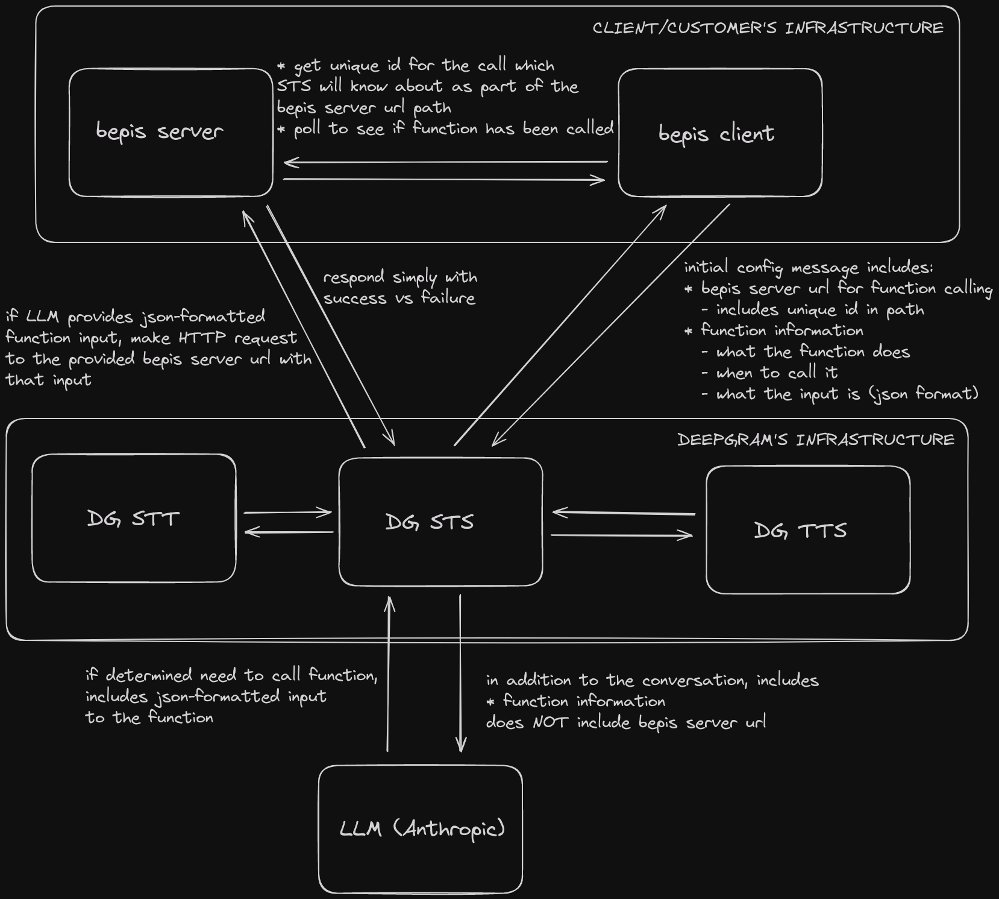

# bepis-lite

This branch of bepis-lite demonstrates how you can add items to a menu on the back-end server, and use that information in the front-end client
when interfacing with Deepgram STS.

The architecture is explained by the following diagram:



## Example Output

Here is some example output from the client:

```
{"type":"ConversationText","role":"user","content":"Hello. Can I have a Coke?"}
null
{"type":"ConversationText","role":"assistant","content":"Certainly, let me add a Coke to your order."}
null
{"type":"ConversationText","role":"assistant","content":"The Coke has been added to your order."}
{"items":[{"name":"coke","description":"a beverage","price":1.5,"category":"beverage"}]}
{"type":"ConversationText","role":"assistant","content":"Please let me know if you need anything else!"}
{"items":[{"name":"coke","description":"a beverage","price":1.5,"category":"beverage"}]}
{"type":"UserStartedSpeaking"}
{"items":[{"name":"coke","description":"a beverage","price":1.5,"category":"beverage"}]}
{"type":"AgentAudioDone","turn_index":0}
{"items":[{"name":"coke","description":"a beverage","price":1.5,"category":"beverage"}]}
{"type":"ConversationText","role":"user","content":"Can I have a Pepsi also?"}
{"items":[{"name":"coke","description":"a beverage","price":1.5,"category":"beverage"}]}
{"type":"ConversationText","role":"assistant","content":"Okay, I'll add a Pepsi to your order as well."}
{"items":[{"name":"coke","description":"a beverage","price":1.5,"category":"beverage"}]}
{"type":"ConversationText","role":"assistant","content":"Please let me know if you need anything else!"}
{"items":[{"name":"coke","description":"a beverage","price":1.5,"category":"beverage"},{"name":"pepsi","description":"a beverage","price":2.5,"category":"beverage"}]}
```
I haven't made the print statements that great yet, but they are showing the conversation as it occurs, as well as the results
of polling the bepis-lite server to see if any items have been added to my order yet (by Deepgram STS, via the LLM function-calling).
The `null` which appears twice means that no items have been added to my order yet.
Then you see how after I requested a Coke, it was indeed added to my order. When I asked for a Pepsi too, that got added as well.

## Key Parts

Let's go over some key parts of the bepis-lite client (the server is extremely simple, nothing special going on there).

First, let's note the client specifies the following urls:
```
STS_URL = "wss://sts.sandbox.deepgram.com"
BEPIS_SERVER_URL = "https://wcdonaldsquest.deepgram.com"
#STS_URL = "ws://localhost:4000"
#BEPIS_SERVER_URL = "http://localhost:3000"
```
I am hosting this server at wcdonaldsquest.deepgram.com, but you can always choose to use local services for development as well.

Moving along, we have two main asynchronous tasks/functions, a sender, and a receiver. The sender forwards audio from the microphone
to Deepgram STS, and the receiver receives messages from Deepgram STS - for binary messages, we forward that onwards to be
played back by the speakers, and for text messages we simply print them.

This is all in-line with the typical Deepgram STS client examples. Where this client differs is in how it handles function
calling and interactions with the bepis-lite server.

Let's start to look at the sender:
```
        async def sender(ws):
            # clear the menu to give ourselves a fresh start
            response = requests.delete(BEPIS_SERVER_URL + "/menu")

            # add some items to the menu
            response = requests.post(BEPIS_SERVER_URL + "/menu/items", json = {"name": "coke", "description": "a beverage", "price": 1.50, "category": "beverage"})
            response = requests.post(BEPIS_SERVER_URL + "/menu/items", json = {"name": "pepsi", "description": "a beverage", "price": 2.50, "category": "beverage"})

            # get the full menu so that we can give it to the LLM
            response = requests.get(BEPIS_SERVER_URL + "/menu")
            menu = response.text

            # we let the bepis backend server know we have a new call,
            # and we retrieve a unique id for this/the call
            response = requests.post(BEPIS_SERVER_URL + "/calls")
            id = response.text
            id_queue.put_nowait(id)
```
The first thing we do is make a `DELETE` request to the bepis-liter server to clear whatever menu it has loaded. Then we make `POST`
requests to freshly populate the menu. Finally we get the full menu with a `GET` request - we will use the result of this request
later when prompting our LLM.

Next we make a `POST` request to the bepis-lite server and obtain a new call id.
We also send this id to a queue so that our other asynchronous task, the receiver, can grab it. Cool.

What is this id and the menu used for? Let's take a look at the next part of the sender function:
```
            config_message = {
                "type": "SettingsConfiguration",
                "audio": {
                    "input": {
                        "encoding": "linear16",
                        "sample_rate": 48000,
                    },
                    "output": {
                        "encoding": "linear16",
                        "sample_rate": 16000,
                        "container": "none",
                        "buffer_size": 250,
                    },
                },
                "agent": {
                    "listen": {"model": "nova-2"},
                    "think": {
                        "provider": "anthropic",
                        "model": "claude-3-haiku-20240307",
                        "instructions": "You work taking orders at a drive-through. The menu, including the names, descriptions, and prices for the items that you sell, is as follows: " + menu,
                        # this function is what STS will call to add items to the order
                        # for this call (note the "id" portion of the path)
                        "functions": [
                            {
                                "name": "add_item",
                                "description": "Add an item to an order. Only use this function if the user has confirmed that they want to add an item to their order and that that item is on the menu.",
                                "url": BEPIS_SERVER_URL + "/calls/" + id + "/order/items",
                                "input_schema": {
                                    "type": "object",
                                    "properties": {
                                        "item": {
                                            "type": "string",
                                            "description": "The name of the item that the user would like to order. The valid values come from the names of the items on the menu.",
                                        }
                                    },
                                    "required": ["item"],
                                },
                            }
                        ],
                    },
                    "speak": {"model": "aura-asteria-en"},
                },
            }

            await ws.send(json.dumps(config_message))
```
So we are telling the LLM in the `instructions` field what the menu is, and asking it to not let users pick anything that isn't on the menu. Cool,
so that's how the menu is being used, but what about the call id?

Ah! So in the config message we send to Deepgram STS at the beginning of the stream, we are specifying a function,
named "add_item", and we are specifying a URL here which specifies the endpoint `/calls/:id/order/items`. So Deepgram STS
can use its internal LLM function calling to call out to this endpoint, which references this specific call via the id
in the endpoint path! And how does this help us? Well let's skip ahead and look at the receiver function for a moment:
```
        async def receiver(ws):
            id = await id_queue.get()
            try:
                speaker = Speaker()
                with speaker:
                    async for message in ws:
                        if type(message) is str:
                            print(message)

                            # check the status of the order for this call
                            response = requests.get(BEPIS_SERVER_URL + "/calls/" + id + "/order")
                            print(response.text)
                        elif type(message) is bytes:
                            await speaker.play(message)
```
We see that every time we get a text message from the Deepgram STS service, we also call out to hit
the `/calls/:id/order` endpoint of the bepis-lite server to see if items have been added to the order yet. This
is some quick-and-dirty polling, and it would probably be better to spin up a dedicated task which did
this polling on a timer or something instead. But here we see how our client can inspect whether or not the function has been called (instead
of just taking the LLM's word for it - the LLM actually can often lie about this).
